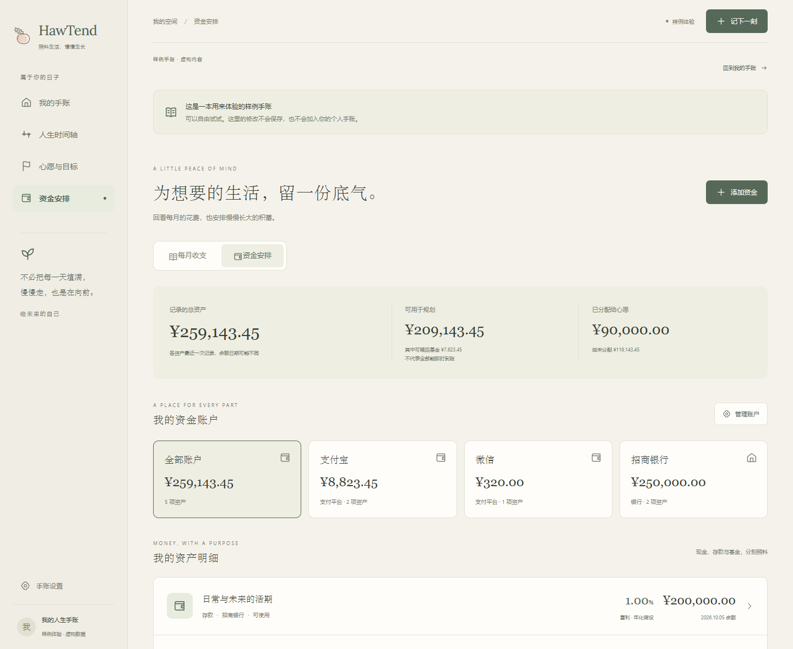

# HawTend · 人生手账

照料生活，慢慢生长。

HawTend 是一本把**值得记住的日子、未来想做的事和为它们准备的资金**放在一起的个人手账。温暖的纸色、手绘山楂和可拖动的时间轴，让记录与规划更接近日常生活。

**当前版本：v0.0.11，本地原型。** 可以在 Windows 上直接运行，也可以从源码在浏览器中使用。个人记录保存在本机；账号登录、云同步和 iPhone 在线安装仍在开发计划中。

[下载 Windows 版](https://github.com/Flying-Angels/HawTend/releases/tag/v0.0.11) · [从源码运行](#从源码运行) · [数据保存说明](#数据保存说明) · [后续计划](#后续计划)

## 现在可以做什么

| 页面 | 功能 |
| --- | --- |
| 我的手账 | 查看近期记录、心愿进度与资金概览；新手账从空白开始，也可以打开独立的虚构样例 |
| 人生时间轴 | 在同一条时间轴上查看已发生的事情与未来目标，拖动、按分类筛选；滑块调整 1–100 年跨度，点击年份设置起止年份 |
| 心愿与目标 | 设置目标日期、预算、已准备金额、进度和说明 |
| 记下一刻 | 用统一的手账字体写事情与感想，支持加粗、斜体、下划线及 LaTeX 数学公式；设置日期、分类及三级重要程度，预览日期调整并撤销 |
| 资金安排 | 每月记录收入和支出；自定义平台、银行账户，分别记录现金、存款与基金；基金可手动更新市值 / 盈亏，存款可设年化和期限 |
| 手账设置 | 自定义分类名称、颜色与图案，切换三种配色，导出 JSON 文件 |

<details>
<summary>展开界面预览（虚构样例，不是个人数据）</summary>




</details>

## Windows：下载后直接使用

日常使用推荐这个方式，**不需要安装 Node.js、下载源码或部署服务器**。

运行环境：Windows 10 / 11、.NET Framework 4.8，以及 Microsoft Edge。启动器会用 Edge 打开独立窗口；找不到 Edge 时使用系统默认浏览器。

1. 打开 [v0.0.11 下载页](https://github.com/Flying-Angels/HawTend/releases/tag/v0.0.11)，在 **Assets** 中下载 **`HawTend-v0.0.11-windows.zip`**。`Source code` 是源码，日常使用不需要下载它。
2. 将 ZIP **完整解压**到一个固定文件夹，例如 `D:\Apps\HawTend`。
3. 双击解压后的 **`HawTend.exe`**，开始使用。首次打开是空白手账；点击“看看样例”可以先试用功能。
4. 想从桌面打开：右键 `HawTend.exe` →“发送到”→“桌面快捷方式”。Windows 11 可先点击“显示更多选项”。若要指定透明图标，在快捷方式“属性 → 更改图标”中选择同目录的 `HawTend-transparent.ico`。

压缩包内包含程序、透明图标和使用说明。EXE 内置全部页面资源，运行时只在本机提供页面，地址固定为 `http://127.0.0.1:4173/`。关闭独立应用窗口会退出程序；右下角托盘也可以打开已有窗口或关闭应用并退出。托盘使用适合小尺寸的透明图标。默认浏览器回退或无法验证窗口归属时，菜单会显示“停止本机服务”，浏览器页面需自己关闭。

**更新方法：**先在“手账设置”中导出记录，关闭手账窗口，再从托盘退出 HawTend。解压新版并替换程序后重新打开；已有快捷方式请保持指向新版文件。使用同一浏览器、同一配置文件和同一地址，才能继续读取原手账。

桌面版目前未做数字签名和自动更新。打包与页面资源已在开发电脑核对，其他电脑的运行情况仍需反馈。

## 从源码运行

适合开发、修改界面，或希望在浏览器中运行的人。**当前本地版不需要 Supabase 账号，也不需要配置 `.env`。**

### 1. 安装开发工具

- [Node.js 24 LTS](https://nodejs.org/en/download)，安装时保留 npm 和加入 PATH 的选项。已验证的 Node.js 版本是 `24.19.0`。
- [Git](https://git-scm.com/downloads)，用于下载与更新源码。

安装后重新打开终端，确认这些命令能显示版本：

```sh
node --version
npm --version
git --version
```

Windows PowerShell 如果提示 `npm.ps1` 无法运行，可以将下文中的 `npm` 写成 `npm.cmd`。

### 2. 下载、安装依赖、构建

```sh
git clone https://github.com/Flying-Angels/HawTend.git
cd HawTend
npm ci
npm run build
```

首次安装依赖需要联网。也可以在仓库页面选择 **Code → Download ZIP**，完整解压后在含有 `package.json` 的目录执行最后两条命令。

### 3. 打开应用

```sh
npm run preview
```

保持这个终端运行，在浏览器中打开 **http://127.0.0.1:4173/**。终端按 `Ctrl+C` 可以停止服务。页面首次成功加载后，离线缓存会保存应用资源；日常运行仍建议保留本机服务。

Windows 安装完依赖后，也可以双击项目根目录的 **`启动HawTend.cmd`**。它会按需构建、在后台启动预览并打开浏览器。直接双击 `index.html` 无法运行这个应用。

### 4. 自己生成 Windows EXE（可选）

在 **64 位 Windows** 上，完成依赖安装后执行：

```powershell
powershell.exe -NoProfile -ExecutionPolicy Bypass -File scripts/build-windows.ps1
```

脚本会构建页面，并使用本机 .NET Framework 编译器生成：

```text
releases/windows/HawTend.exe
releases/windows/HawTend-transparent.ico
```

编译器缺失时需要先安装 .NET Framework 开发环境；直接使用下载页的 Windows 包不需要编译器。生成的程序不依赖项目源码或 Node.js。`releases/`、`dist/` 和依赖目录不会提交到 Git。

## 数据保存说明

- **个人手账**保存在当前浏览器、当前网站地址的 IndexedDB 中。首次使用没有预填记录。
- **“看看样例”**使用虚构内容，修改只用于当次体验，不会写入个人手账。
- 更换设备、浏览器、浏览器配置文件或地址，会看到另一份本地手账。例如开发模式的 `5173` 端口与正式预览的 `4173` 端口分别保存数据。
- 复制 EXE、更新源码或公开 GitHub 仓库，都不会把浏览器中的手账上传或带到另一台电脑。
- 可以在“手账设置”导出 JSON，保留记录副本。**导入恢复尚未实现**；清理浏览器网站数据会删除本地手账。

“今天”按设备本地日期显示，跨午夜及回到页面时自动更新。新记录默认使用当天日期，时间轴按真实日期定位圆点。浏览时间轴不会修改记录日期。

资金计算仍是原型试算：目标月储蓄以当天为起点，固定年化资产从各自余额参考日推算；手动市值资产不套用年化。已有每月实际收入与支出结算，但没有逐笔记账、自动资金转账、账单文件导入或投资产品接入。新增储蓄默认按 0% 收益试算，只有明确计划投入时才设置其收益假设。

## 资金账户与基金市值

打开 **资金安排 → 资金安排**，先点“管理账户”，添加支付宝、微信、银行或具体银行卡。再点“添加资金”或已有资产，为它选择所在账户。一个账户可以同时有现金、存款、基金；账户总额由资产自动合计，不另外填一次余额。

基金选择 **资产类别：基金 → 收益记录方式：手动更新市值**，填当前金额和余额日期作为起点。之后点击 **“更新市值 / 盈亏”**，每月填写最新持有市值，或上次记录以来的盈利 / 亏损。期间有买入、赎回或现金分红时可展开补填，避免把追加资金算成收益。同日更正会替换旧记录，可撤销。

旧资金保留原金额和参考日期，显示为“暂未归到账户”，可以逐项设置，不会自动改成基金。金额精确到分，市值历史与固定年化预测分别展示。基金的可赎回金额计入规划池，但不表示即时到账；实际亏损仍可保存，目标分配不足时提示检查。

市值更新和账户间转账不会自动写入月度收入、支出或其他现金余额。买入后减少闲置余额，赎回到账后更新接收账户，防止重复记录。完整口径与例子见 [资金账户与手动市值](docs/21-资金账户与手动市值.md)。

## 每月收支与提醒

打开 **资金安排 → 每月收支**，点击“补记上个月”或“记录一个月”，填写月份、实际收入和实际支出两个总额，备注可留空。可以补记历史月份、修改和撤销；同月更新会替换旧金额，不重复累加。

月结余不会自动增加资金余额。未投入的钱可点“记录未计息余额”，按实际余额设置 0% 年化；投入后相应减少日常余额，再记录新的计息资金。自己账户间转账不算消费。目标试算会参考上月支出，也可以临时调整。

首页与收支页会提示尚未补记的上个月。需要程序关闭时仍提醒，点“加入月初提醒”，下载并导入 ICS 到支持的日历：每月 1 日当地时间 10:00 提醒。**文件下载后仍需自行确认导入及日历通知权限，并未自动添加或启用通知。** 不需要部署提醒服务器；实际通知取决于日历客户端，手机日历导入尚未实机验证。

逐笔记账与支付宝、银行账单文件导入列在后续计划，当前不支持自动拉取个人账单。方案与计算口径见 [月度收支说明](docs/19-月度收支与月初提醒.md)。

## 文字格式与公式

“发生了什么”和“留给自己的话”均提供 **编辑 / 预览** 两种视图。选中文字，点击工具栏的 **B、I、U**，或按 `Ctrl+B`、`Ctrl+I`、`Ctrl+U`（Mac 使用 `⌘`），即可插入加粗、斜体、下划线格式。`Ctrl+Z` 撤销，`Ctrl+Shift+Z` 重做。编辑时显示语法，点击“预览”看到排版效果。

- 行内公式：`$x^2$`、`$\frac{a}{b}$`。
- 独立公式：用单独占行的 `$$` 包住公式；也可点击 **∑** 工具插入模板。
- 支持 Markdown 列表、引用和链接；普通换行会在预览中保留。
- 公式使用 KaTeX 支持的 LaTeX 数学语法，不支持完整 `.tex` 文档或自定义宏包。字体与渲染器已内置，可离线使用。
- 旧记录仍按普通文字显示；点击工具或“启用格式”才开始解析语法。源文随记录保存并包含在 JSON 导出中。普通美元符号在格式模式下可写成 `\$`。

## iPhone 和云同步

手机布局、PWA 清单与离线缓存已经准备好，但**目前没有已发布的在线网址，Windows 与 iPhone 尚不能同步**。手机不能通过电脑的 `127.0.0.1` 地址访问应用。

计划先提供 HTTPS 在线版，让 iPhone 使用 Safari“添加到主屏幕”，再接入登录和云同步。这个路线使用 PWA，无需以原生 iOS App 的方式发布。云端计划采用免费额度内的托管服务，个人数据与 GitHub 源码分开保存；你不需要自己维护服务器。

支付宝个人消费流水、Apple 健康数据和体检报告分析均未接入，不能把这些当作当前版本的功能。

## 开发与检查

客户端使用 React、TypeScript 和 Vite；本地数据使用 IndexedDB。Windows 启动器是 C# 编写的轻量程序。`src/cloud/` 与 `supabase/` 中已有同步适配器、迁移和权限测试草案，尚未接入实际应用。

```sh
npm run dev            # 开发模式，终端显示访问地址
npm run build          # 类型检查、生产构建、生成离线缓存
npm run check:finance  # 资金计算边界检查
npm run check:assets   # 账户归属、市值盈亏与同日更正检查
npm run check:cloud    # 本地同步协议与数据校验检查，不连接云数据库
npm run check:monthly  # 月结算、旧数据兼容与月初日历事件检查
npm run check:calendar # 当地日期、午夜和跨年检查
```

```text
src/        页面、样式、本地数据与资金计算
public/     品牌图标、PWA 清单与字体授权
windows/    Windows 启动器源码
scripts/    构建、打包、预览与检查脚本
supabase/   后续云同步的迁移和权限测试草案
docs/       需求、技术方案与历次设计开发记录
```

## 后续计划

1. 完成 HTTPS 托管、账号登录、Windows / iPhone 云同步与实机验证。
2. 完善目标资金分配、收入与储蓄推算、收支曲线和数据导入恢复。
3. 逐步加入可选逐笔记账、账单文件导入、健康档案与报告导入。

详细范围见 [需求与分期计划](docs/01-需求与分期计划.md) 和 [技术选型与接入边界](docs/02-技术选型与接入边界.md)。`docs/` 也保留阶段开发记录，其中本机截图和构建产物位于未提交的目录，不是公开下载入口。

HawTend 字标使用 Lora，公式使用 KaTeX 及其内置字体。授权见 [字体说明](public/brand/font-licenses/README.md)、对应 OFL 文件及 [KaTeX MIT 许可](public/brand/font-licenses/KaTeX-MIT.txt)。
