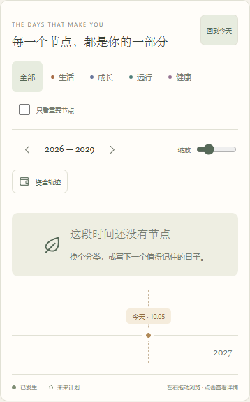

# HawTend：时间轴空状态布局修正

日期：2026-10-06。版本：**0.0.7**。

## 问题与调整

打开空白时间轴，或切换到没有记录的分类、年份范围时，“这段时间还没有节点”提示原来绝对定位在时间轴画布内，与“今天”标签、圆点及虚线重叠。

提示现在放在时间轴上方的独立区域，使用手账现有配色、叶片图案与文字层级。横向浏览时提示保持在页面内；今天标记、轴线与年份留在下方。空时间轴画布缩短为 112px，减少无节点时的大片留白。有节点时仍采用原节点布局。

## 实际界面

以下来自独立 Chromium 配置中的空白手账，没有使用或写入用户的实际浏览器数据。

## 验证

- TypeScript 与生产构建通过。
- 1440、390、320px 浏览器视口：提示完整可见，页面没有横向溢出；今天标签与提示在不同高度。
- 空白手账、无记录分类、只看重要节点、无节点年份范围：空状态正确显示。
- 缩放和键盘横向浏览：提示不跟随时间轴移动，不与今天标签重叠。
- 样例正常节点及返回当前年份：空状态移除，恢复正常节点布局；浏览器没有脚本错误。

手机验证是 Chromium 视口检查，不是 iPhone Safari 实机测试。没有修改记录、资金计算、数据库名称或本地保存键。

## 桌面交付

`HawTend.exe` 与 `HawTend-0.0.7.exe` 均为 **0.0.7.0**，大小 **3,091,456 字节**。SHA-256：`F847358FA2A87A19A21D775D22FAEAFAD0D80A348CA7407010BD258943433211`。

只读资源核对确认 EXE 内置的 25 个文件与本次网页构建逐个一致，透明图标一致。本次未独立启动新版 EXE；实际界面检查使用临时 4180 预览。标准 EXE 已更新，原 0.0.6 文件留存备份，原服务和窗口未强制结束。

桌面快捷方式继续指向标准程序。请关闭手账窗口与标签页，从右下角托盘退出 HawTend，再打开桌面快捷方式，加载新版。

公开下载入口：[HawTend v0.0.7](https://github.com/Flying-Angels/HawTend/releases/tag/v0.0.7)。
