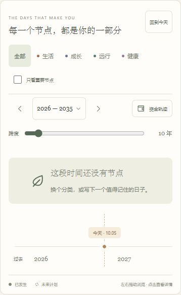

# HawTend：自定义时间跨度与年份范围

日期：2026-10-06。版本：**0.0.8**。

## 使用方式

用户指出旧“缩放”滑块只改变画布宽度，而上方年份范围仍固定为四个年份，无法按预期调整时间跨度。

- 拖动 **跨度** 滑块，在 **1–100 年**之间调整时间范围。右侧显示当前年数，上方年份、节点位置与刻度一起变化。
- 点击年份范围，填写 **起始年份** 与 **结束年份**，再点击“应用时间范围”。支持 1900–2200 年内、最长 100 年的范围。
- 弹窗也提供 1、3、5、10、20、50、100 年快捷选择。
- 起止年份都包含在内。例如 2006–2009 共 4 年，2006–2025 共 20 年。
- 左右箭头按当前跨度翻页。“回到今天”保留所选年数，返回参考日所在年份，并将标记带回可见区域。
- 一年范围显示月份刻度；长范围按间隔显示年份，密集节点仍可点击展开详情。

这是当前页面内的浏览设置，不修改事情日期、目标日期、金额或手账存储。资金轨迹仍按已经审阅的独立十年预测呈现，不是当前时间轴上的叠加曲线。

## 实际界面

截图使用独立 Chromium 配置中的空白手账。手机是浏览器视口检查，不代表 iPhone Safari 实机验证。

## 验证

TypeScript 与生产构建通过。浏览器实际检查：

| 场景 | 结果 |
| --- | --- |
| 滑块选择 10 年 | 2026–2035，共 10 年，年份与滑块值一致 |
| 前后翻页 | 10 年跨度前后移动 10 年 |
| 手动范围 | 2006–2025 与 20 年滑块一致 |
| 无效输入 | 拒绝空白年份、反向年份、101 年范围；取消 / Escape 保留原范围 |
| 最小 / 最大年份 | 1900–1999、2101–2200 的边界翻页按钮禁用 |
| 回到今天 | 保留一年或百年跨度，手机视口中今天标记可见 |
| 刻度与节点 | 一年显示月份；筛选单年不包含未来年份目标；百年密集节点聚合并保留目标详情 |
| 响应式 | 320、390、768、1440px 页面与弹窗没有横向溢出 |
| 数据 | 浏览前后独立浏览器的 IndexedDB 内容逐项一致，无写入手账 |
| 控制台 | 没有脚本错误或警告 |

窗口结束边界改为下一年 1 月 1 日之前，避免把范围外的下一年元旦节点画入当前区间。画布右侧预留完整卡片宽度，范围末端的记录可以完整显示。

## 桌面交付

标准 `HawTend.exe` 与版本副本为 **0.0.8.0**，大小 **3,092,480 字节**。SHA-256：`2E0314379BE4BCBD6F7F80560836F29B669731A0DED8810C9F9849D85207112A`。

只读核对确认 25 个内置文件与网页构建一致，透明图标一致。标准程序已更新，原文件保留备份；用户原服务与浏览器未强制退出。本次未独立启动新版 EXE，界面检查使用临时 4180 预览。

关闭手账窗口与标签页，从右下角托盘退出 HawTend，再打开桌面快捷方式加载新版。

公开下载：[HawTend v0.0.8](https://github.com/Flying-Angels/HawTend/releases/tag/v0.0.8)。
