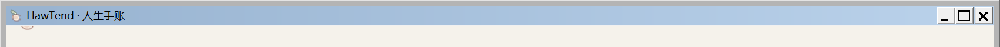

# Windows 顶栏偶发蓝条修复 · v0.0.13

2026-10-06。修复 Windows 窗口失去焦点、重新激活或重绘时，旧式蓝色系统标题栏覆盖纸色顶栏的问题。

## 原因与复现

旧窗口已经用自己的控件画顶栏，但保留了窗口缩放和系统菜单样式。它没有处理 `WM_NCACTIVATE` 和 `WM_NCPAINT`，系统默认处理仍会绘制非客户区，覆盖自定义顶栏。不是网页样式或缓存切回旧版。

在隔离的 v0.0.12 测试窗口中，发送与窗口切换对应的激活 / 失活消息，即可复现和用户截图相同的蓝条。以下图片只包含测试窗口的标题栏，没有个人手账内容。

修复前：



修复后：


微软的 [WM_NCACTIVATE 文档](https://learn.microsoft.com/en-us/windows/win32/winmsg/wm-ncactivate)说明，`lParam = -1` 可以保留默认激活处理而禁止其重画非客户区；[非客户区说明](https://learn.microsoft.com/en-us/windows/win32/gdi/nonclient-area)也要求自定义窗口处理相关绘制消息。

## 修改

- 明确取消系统标题栏样式，保留窗口缩放、系统菜单、最小化和最大化能力。
- 自定义顶部负责绘制；阻止默认非客户区重画。激活 / 失活仍交给系统处理，最小化时保留默认图标处理。
- 两种 `WM_NCCALCSIZE` 调用均使用完整客户区。
- 同时修复连续最大化、最小化和还原时窗口尺寸增大的问题：保存真实窗口矩形，并在整个位置变更处理结束后恢复，避免 WinForms 把已移除的边框尺寸再加回来。
- 从最大化状态最小化后重复启动，继续回到最大化窗口。
- 构建时跳过内容相同的 SDK DLL，避免正在运行的应用锁住 DLL 而阻止构建。

## 验证

在开发电脑 Windows 桌面和独立 QA 文件夹中执行，测试端口与个人应用的 4173 分开。

```powershell
powershell.exe -NoProfile -ExecutionPolicy Bypass -File scripts/check-windows-frame.ps1 -Executable releases/windows/HawTend-0.0.13.exe
powershell.exe -NoProfile -ExecutionPolicy Bypass -File scripts/inspect-windows-package.ps1 -Executable releases/windows/HawTend-0.0.13.exe
```

窗口回归检查包含 12 轮激活 / 失活、非客户区重绘、标题 / 图标更新、最大化 / 还原、最小化 / 还原，以及调整尺寸和最大化后最小化再启动。交替检查系统命令和实际窗口按钮，并检查最小化后重复启动的路径。76 次顶栏捕获均未出现蓝条，普通窗口尺寸没有漂移。捕获直接读取测试窗口已有表面，避免截图操作重新绘制页面而掩盖覆盖问题。检查日志及截图保存在忽略的 `output/windows-frame/` 中。

另以虚构手账验证实际 WebView2 导入、重开保留、标准文件保存对话框导出、窗口按钮、重复启动、边缘缩放命中，以及关闭后停止本机服务。已核对内嵌的 95 份页面资源、图标和三个 SDK DLL。

## 更新

退出旧版后，从原桌面快捷方式重新打开即可使用本机已更新的程序。从 GitHub 安装的用户可下载 [v0.0.13 Windows 包](https://github.com/Flying-Angels/HawTend/releases/tag/v0.0.13)，完整解压并替换旧安装目录中的程序文件。

沿用 v0.0.12 的 `%LOCALAPPDATA%\HawTend\WebView2` 记录位置，无需再次接续手账。此次没有读取、迁移或更改个人记录。验证范围是开发电脑；其他 Windows 电脑和不同显示缩放仍需实际反馈。
