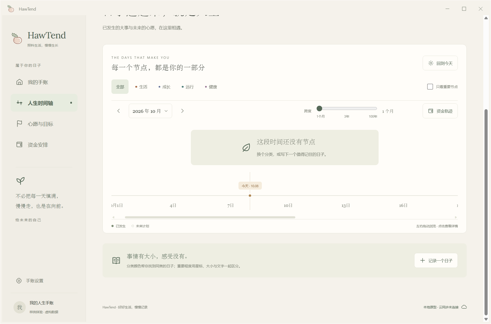

# 非线性时间跨度与月视图

2026-10-08 · v0.0.14

时间轴现在可以缩到一个月，展开到一百年。滑块采用非线性比例，将更多操作空间留给月份和几年内的日子。

## 如何使用

在“人生时间轴”拖动“跨度”滑块，日期范围和刻度同步变化。滑轨下标出三个位置：1 个月、3 年、100 年；右侧显示当前的实际跨度。

| 滑块位置 | 时间跨度 |
| --- | --- |
| 最左端，0% | 1 个月 |
| 四分之一，25% | 6 个月 |
| 中点，50% | 3 年 |
| 四分之三，75% | 17 年 4 个月 |
| 最右端，100% | 100 年 |

点击左侧日期范围，可以选择起始月份和结束月份。两端月份都包含在内，例如 2026 年 10 月至 12 月为 3 个月。快捷选项提供 1、3、6 个月，以及 1、3、10、100 年。

左右箭头按当前跨度翻页：一个月时翻到相邻月份，三个月时移动三个月。“回到今天”保留当前跨度。缩放时，如果今天还在屏幕内，就围绕今天调整范围；若正在浏览其他时间，则围绕当前视野调整，减少重新寻找节点的操作。

## 日期与刻度

跨度以真实日历月份计算：一月是 31 天，普通二月是 28 天，闰年二月是 29 天。范围从起始月份第一天开始，到结束月份的最后一天为止，不用固定 30 天或 365 天近似。

一个月和两个月显示日刻度；三个月至不到两年显示月刻度；更大的范围显示年刻度。刻度密度随跨度调整，末月后的记录不会混入当前范围。可选日期仍为 1900 年 1 月至 2200 年 12 月，一次最多 100 年。

相邻事件仍可能组成聚合节点，点击即可展开各条记录及日期。缩放、翻页和回到今天只改变视图，不修改事件日期、目标、资金或手账内容。资金轨迹继续使用原先单独标注的十年预测范围。

## 界面预览

以下截图来自隔离测试窗口或明确标为虚构的测试手账，不含个人记录。

Windows 独立窗口的一月范围与日刻度：

手机尺寸的月份选择界面：

## 实现与验证

滑块两段使用指数映射：前半段从 1 个月到 36 个月，后半段从 36 个月到 1200 个月，最终取整月。滑块位置独立保存，避免月份取整后，键盘方向键在某些位置无法继续移动。自定义月份范围会反算对应的滑块位置。

- `npm run check:timeline` 验证端点、中点、单调性、全部 1–1200 个月的正反映射、日期边界与有序刻度，并检查跨年和闰年二月。
- `npm run build` 完成 TypeScript 检查、生产构建及离线缓存生成。
- 隔离浏览器验证鼠标拖动、键盘 Home / End / 方向键、相邻月份翻页、跨年自定义范围、非法范围提示，以及“回到今天”。浏览前后虚构手账内容一致，浏览过程没有 IndexedDB 写入。
- 在 320、390、768、1440 像素宽度检查页面和范围弹窗，没有横向页面溢出。
- 在真实 Windows / WebView2 独立窗口验证最小、中点、最大跨度及月范围选择，并核对打包程序内置页面与生产构建一致。

手机检查使用浏览器视口，尚未验证 iPhone 实机。此次不修改存储结构，v0.0.12 及之后的独立窗口版本升级继续读取原手账。
