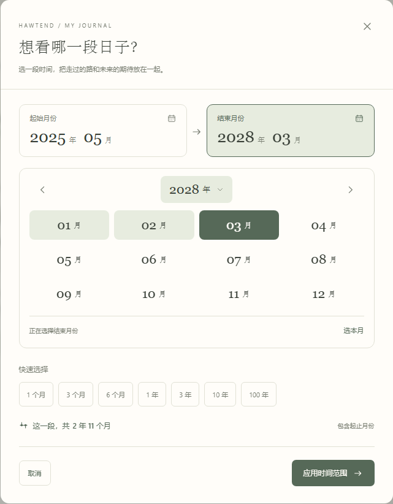
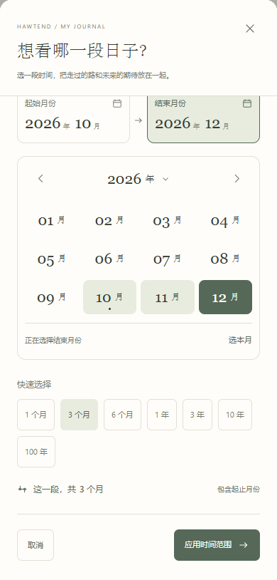

# 手账风格的月份选择

2026-10-08 · v0.0.15

时间范围原来使用浏览器默认的月份弹窗，字体、颜色、边框与 HawTend 页面不一致。本版替换为应用自己的月份面板，沿用纸色、森林绿、衬线数字和圆角，起止月份与选择过程都在同一个窗口中展示。

## 操作方式

1. 在人生时间轴点击日期范围，打开“想看哪一段日子？”。
2. 点击起始月份或结束月份卡片。浅绿色卡片表示当前正在编辑的一端。
3. 从十二个月份中选择；深绿色表示这一端选中的月份，浅绿色表示已处于时间范围内的月份。本月下方有小圆点，也可点“选本月”。
4. 点击年份，可在年份网格中选择，也可填写“跳到年份”直接前往。月份面板两侧箭头翻一年，年份网格两侧箭头翻十二年。
5. 下方实时显示总跨度。点击“应用时间范围”确认；“取消”或关闭不会应用刚才的选择。

保留一个月到一百年的非线性缩放规则、快捷跨度及包含起止月份的计算口径。结束月份早于开始月份、跨度超过一百年时会提示调整，不会直接应用。

## 实际效果

以下界面使用隔离的虚构样例或空白测试手账，不含个人记录。

Windows 独立窗口中的月份选择：

手机尺寸的月份选择：

## 键盘与验证

- Tab 在卡片、年份导航、月份网格和操作按钮之间移动；月份网格只占一个 Tab 停靠点。
- 月份网格支持方向键移动，Home / End 到本年的首月 / 末月，PageUp / PageDown 换年。Enter 或空格选择，移动焦点本身不更改月份。
- 年份跳转可按 Enter；年份网格内按 Escape 返回月份选择，月份选择内按 Escape 关闭窗口。关闭后焦点回到打开它的日期范围按钮。
- 在隔离浏览器验证跨年起止选择、实时跨度、应用与取消、上下限、无效跳年、快捷跨度和焦点循环。浏览过程 IndexedDB 写入为零。
- 检查 320、390、768、1440 像素宽度，没有弹窗横向溢出；月份按钮至少 44 × 44 像素。手机面板可纵向滚动以访问底部操作。
- 真实 Windows / WebView2 窗口验证选择、预览、应用、取消和 Escape，并检查打包程序内置资源与生产构建一致。
- `npm run build` 和 `npm run check:timeline` 通过。此次不新增依赖或修改存储结构。

手机检查为浏览器视口，iPhone 实机仍待后续验证。v0.0.12 及之后独立窗口版本升级继续读取原有手账。
