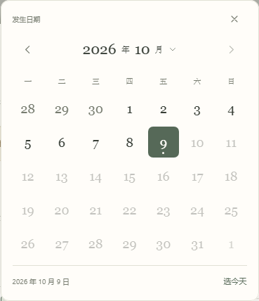
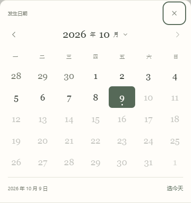
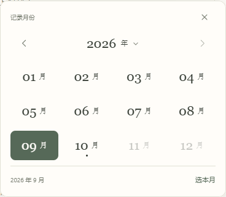

# 统一日期与月份选择

2026-10-09 · v0.0.16

v0.0.15 改造了时间轴的月份范围面板，“记下一个日子”等表单仍使用浏览器默认日历。本版将其余六个入口统一为应用自己的日期 / 月份选择组件，沿用纸色、森林绿、衬线数字与圆角。

## 操作与范围

点击日期字段打开日历。选中日期后填入当前表单，仍需点击表单的保存按钮才写入手账。关闭日历或点击外部区域不会改变日期，也不会关闭正在填写的表单。

点击日历顶部的年月可以选择月份，再点击年份可打开年份网格或直接跳年。“选今天 / 选本月”提供快捷选择。月度收支换月份时保留已经填写的收入、支出和备注。

| 入口 | 选择方式 | 保留的日期约束 |
| --- | --- | --- |
| 日子的发生日期 | 日历 | 不晚于今天 |
| 希望完成的日期 | 日历 | 新建或调整日期时不早于今天，不晚于 2100 年；未改日期的旧目标可继续编辑 |
| 资金余额日期 | 日历 | 不晚于今天 |
| 资金到期日期 | 日历 | 保存时须晚于初始余额日期 |
| 市值记录日期 | 日历 | 最近记录日至今天；选择已有日期时带出该日金额与备注 |
| 月度收支的记录月份 | 月份网格 | 1900 年 1 月至当前月份 |

禁止选择的日期用浅灰显示。原有事件日期调整的预览、确认和撤销流程保留，日期仍以 `YYYY-MM-DD` 或 `YYYY-MM` 保存，不修改存储结构。时间轴的起止月份面板继续使用 v0.0.15 的卡片与范围预览。

## 实际界面

以下截图来自隔离的空白测试手账或虚构样例，不含个人记录。

Windows 独立窗口中的日期选择：

手机尺寸的底部日期面板：

月度收支的月份选择：

## 交互与验证

桌面日历根据字段位置在上下方展开，并保持在窗口内；手机尺寸下使用底部面板。日历使用浏览器支持的顶层对话框，避免被长表单或滚动区域裁切。关闭后焦点回到对应字段。

日网格支持方向键、周首 / 周末 Home / End、换月 PageUp / PageDown；加 Shift 可换年。月网格支持方向键和换年。Enter 或空格确认选择。Escape 从年份返回月份，再返回日历，最后关闭日期选择；不会直接丢掉外层表单。Tab 保留在打开的日历内。

- `npm run check:picker` 验证闰年、无效日期、周一开始的日历网格、换月时的月末修正、跨年及支持日期边界。
- `npm run build`、`npm run check:calendar`、`npm run check:timeline` 通过。
- 隔离浏览器逐一验证全部六个入口、日期上下限、闰日、年份跳转、键盘与焦点、取消及月度金额保留。
- 在 320、390、768、1440 像素宽度检查弹窗位置、横向溢出和触摸目标；日历按钮至少 44 × 44 像素。
- 选择和浏览日期期间没有 IndexedDB 写入；虚构事件的日期调整预览、确认保存及撤销恢复均通过。
- 在真实 Windows / WebView2 独立窗口验证顶层日历、闰日、Escape、月度选择和金额保留，并核对程序内置资源与生产构建。

手机检查使用浏览器视口，尚未进行 iPhone 实机验证。v0.0.12 及之后的独立窗口版本升级继续读取原有手账。
